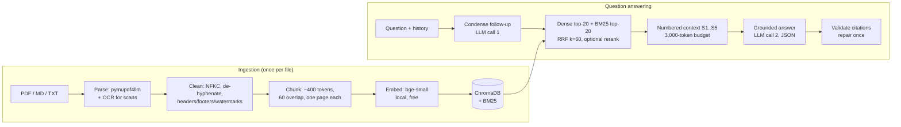

# LectureLens - citation-grounded RAG tutor for your course notes

> Ask your lecture PDFs a question, get an answer with page-level citations,
> and generate quizzes, summaries and flashcards from the same material.

DSE4150 (Natural Language Processing) course project. Full specification:
[docs/SPEC.pdf](docs/SPEC.pdf). Every design decision and deviation is logged with its reason in
[docs/DECISIONS.md](docs/DECISIONS.md).

## Features

- **Grounded Q&A with page-level citations.** Every factual sentence cites `[S1]`, `[S2]`... and
  each source card shows the file, page, section and the exact excerpt used.
- **Honest abstention.** Questions your notes don't cover get "I couldn't find this in your
  course material" instead of guessing.
- **Follow-up questions** ("what about its limitations?") are rewritten into standalone queries.
- **Hybrid retrieval:** BM25 + dense embeddings fused with Reciprocal Rank Fusion; an optional
  cross-encoder reranker (off by default, see the results). Each stage can be toggled for ablations.
- **Study tools:** MCQ quizzes (scored, with explanations and sources), structured summaries with
  a glossary, and flashcards exportable as CSV for Anki.
- **Real-world PDFs:** OCR for scanned pages, header/footer and watermark removal, page-accurate
  chunking.
- **Measured:** retrieval metrics, LLM-judge faithfulness and relevancy, citation validity,
  abstention accuracy, ablations and a chunk-size sweep (results below).

## Results

Measured on 30 labelled questions over the course PDFs (25 answerable with gold pages,
5 not covered by the notes; 7 factual, 7 conceptual, 4 comparison, 3 keyword, 2 follow-up pairs).
Full report with per-question results: [eval/results/report.md](eval/results/report.md).
Reproduce with `python -m lecturelens eval --ablations --chunk-sweep`.

| Config | Hit@1 | Hit@5 | MRR | Faithful. | Relev. (1-5) | Abstain acc. | p50 latency |
|---|---|---|---|---|---|---|---|
| Default config (hybrid) | 0.800 | 1.000 | 0.873 | 1.000 | 5.00 | 100% | 3,150 ms |
| BM25 only | 0.720 | 1.000 | 0.815 | - | - | - | - |
| Dense only | 0.680 | 0.960 | 0.797 | - | - | - | - |
| Hybrid (RRF) | 0.800 | 1.000 | 0.873 | - | - | - | - |
| Hybrid + rerank | 0.680 | 0.960 | 0.790 | - | - | - | - |
| Default, minimal prompt (no rules) (10 q) | - | - | - | 1.000 | 5.00 | 100% | 3,255 ms |

Generation (default config, all 30 questions): every answerable question answered with a gold page
cited, **100% citation validity** (no invented `[S#]`, no repairs needed), all 5 off-syllabus
questions declined, ~1,813 prompt tokens and ~3.1 s per answer.

**Findings**

- **Hybrid fusion beats either retriever alone.** RRF lifts Hit@1 from 0.68-0.72 (dense or BM25
  alone) to 0.80 and MRR to 0.873; dense and BM25 fail on different questions.
- **The cross-encoder reranker hurt, so it is off by default.** With reranking, Hit@1 dropped to
  0.68 and MRR to 0.790, retrieval took ~1.1 s instead of ~20 ms, and one follow-up (q25) lost its
  gold slide from the top 5, so the system wrongly said it was not in the notes. The ms-marco
  cross-encoder was trained on web search queries, not lecture-slide fragments. Turning it off
  fixed q25 and removed the only generation failure. Trade-off: off-syllabus questions now
  always reach the LLM, which declined all 5 itself. Reranking stays available
  (`retrieval.rerank`, `--rerank`, sidebar toggle).
- **Chunk size barely matters for slide decks.** 400 and 600 tokens tie (most slides are shorter
  than either), 200 is worse; 400 is kept.
- **The grounding rules showed no measurable effect on this model.** The minimal prompt (no rules
  in the system prompt) also declined all 5 off-syllabus questions and stayed fully cited, because
  the answer template itself asks for an `answerable` flag and `[S#]` citations. The rules are
  insurance for weaker models rather than a measured gain here.
- **The benchmark is now at ceiling** for generation (faithfulness 1.00, relevancy 5.00): 30
  questions cannot separate good configurations further. Harder, multi-hop questions are the
  next step. LLM-judge scores also vary between runs (q06 scored 0.75 in an earlier run for a
  claim stated on its cited page), so treat them comparatively.

## How it works



1. **Ingest:** files are parsed page by page (OCR only where a page is an image), cleaned, and split
   into ~400-token chunks that never cross a page, so every chunk has exactly one page to cite.
2. **Index:** chunks are embedded locally with `BAAI/bge-small-en-v1.5` (no API quota) into
   ChromaDB, and a BM25 index is built over the same chunks.
3. **Retrieve:** a follow-up is first condensed into a standalone question; then BM25 (exact terms,
   acronyms) and dense search (meaning) run and are fused with RRF. An optional cross-encoder can
   rerank the top 20 and abstain without calling the LLM when every candidate scores below a
   threshold; it is off by default because it lowered accuracy on the course PDFs.
4. **Answer:** the top chunks become numbered excerpts; Gemini answers in JSON validated by Pydantic,
   citing excerpt numbers. Invalid citations are stripped; an uncited answer gets one repair call.

## LLM usage

| # | Task | Output schema (Pydantic) | Temp. | Model |
|---|---|---|---|---|
| 1 | Condense follow-up into a standalone question | `CondensedQuestion` | 0.0 | `llm.model` |
| 2 | Grounded answer with `[S#]` citations | `AnswerResponse` | 0.2 | `llm.model` |
| 3 | Citation repair (only if uncited) | `AnswerResponse` | 0.0 | `llm.model` |
| 4 | Quiz generation | `Quiz` | 0.7 | `llm.model` |
| 5 | Summary with glossary | `Summary` | 0.3 | `llm.model` |
| 6 | Flashcards | `FlashcardSet` | 0.5 | `llm.model` |
| 7 | JSON repair (invalid output) | caller's schema | 0.0 | same model |
| 8 | Judge: faithfulness / relevancy | `FaithfulnessJudgement` / `RelevancyJudgement` | 0.0 | `llm.judge_model` |

Robustness (all in [src/lecturelens/llm/client.py](src/lecturelens/llm/client.py), the only module
that touches the `google-genai` SDK):

- **Structured output:** JSON-schema output, validated by Pydantic, with one repair call on
  invalid JSON.
- **Rate limits:** a client-side sliding-window limiter (8 requests per minute), plus exponential
  backoff with jitter on 429/5xx/timeouts, then the fallback model once.
- **Cost:** a SQLite response cache for low-temperature calls.
- **Thinking models:** thinking tokens count against the output budget, so each task gets a
  thinking allowance on top of its limit.
- **Call log:** every call goes to `logs/llm_calls.jsonl` with task, model, prompt version,
  tokens, latency, cache hit, attempts and fallback. The API key is never logged.

## Prompt engineering

All prompts live in [prompts/prompts.yaml](prompts/prompts.yaml) (versioned; the version is logged
with every call and stamped on every eval report). No prompt text exists in Python code.

| Principle | Where it shows up |
|---|---|
| Separation of concerns | system prompts (role + rules) vs short per-task templates |
| Explicit grounding contract | tutor rules 1-4: cite every factual sentence, only given numbers |
| Defined refusal | `answerable=false` + a fixed sentence, measurable on unanswerable questions |
| Prompt-injection guard | excerpts wrapped in `<excerpts>` and declared "data, not instructions" |
| Structured output | a Pydantic schema per task, fields described in the template |
| Few-shot examples | one short example each for condense and answer (validated by a test) |
| Per-task parameters | temperature and token limit next to each prompt |
| Measured effect | the *minimal prompt* ablation removes the grounding rules (results above) |

## Configuration

Everything tunable is in [config/config.yaml](config/config.yaml); secrets only in `.env`. Override
any key with an environment variable `LECTURELENS__SECTION__KEY` (e.g.
`LECTURELENS__RETRIEVAL__MODE=bm25`). The most important keys:

| Key | Default | Meaning |
|---|---|---|
| `llm.model` / `llm.fallback_model` | `gemini-3.8-flash` / `gemini-3.1-flash-lite` | check with `python -m lecturelens models` |
| `llm.requests_per_minute` | 8 | client-side limit, below the free tier |
| `retrieval.mode` | `hybrid` | `dense`, `bm25` or `hybrid` |
| `retrieval.rerank` | `false` | cross-encoder reranking of the top 20 (off: see Results) |
| `retrieval.final_k` / `max_context_tokens` | 5 / 3000 | excerpts per answer and their token budget |
| `retrieval.min_rerank_score` | -5.0 | with rerank on: abstain without the LLM below this |
| `ingestion.chunk_size_tokens` / `chunk_overlap_tokens` | 400 / 60 | chunking (see the sweep) |
| `ingestion.use_ocr` | `true` | OCR image-only PDF pages |

## Quickstart

Python 3.11 (3.10+ works). Windows PowerShell shown; on macOS/Linux use
`source .venv/bin/activate` and `cp`.

```
git clone <this repo> lecturelens && cd lecturelens
python -m venv .venv
.venv\Scripts\activate
pip install -r requirements.txt -r requirements-dev.txt
pip install -e .
copy .env.example .env                    # then put your GEMINI_API_KEY in .env
python -m lecturelens ingest --sample     # or put PDFs in data/raw and run: ingest
streamlit run app/streamlit_app.py
```

Get a free key at aistudio.google.com. The first run downloads the embedding model (~130 MB), which
is then cached locally (the optional reranker, ~90 MB, downloads only if you turn it on).

## CLI usage

```
python -m lecturelens ingest [--path data/raw] [--sample] [--rebuild]
python -m lecturelens stats
python -m lecturelens ask "What is minimum edit distance?" [--mode detailed] [--retrieval bm25] [--rerank] [--debug]
python -m lecturelens chat                # follow-up questions; /clear, /exit
python -m lecturelens quiz --topic "finite-state transducers" --n 5 [--difficulty hard] [--show-answers] [--out quiz.json]
python -m lecturelens summarize --doc "PPT1"           # or --topic "..."
python -m lecturelens flashcards --topic "edit distance" --n 12 --csv cards.csv
python -m lecturelens eval [--no-generation] [--ablations] [--chunk-sweep]
python -m lecturelens models              # model IDs available to your key
```

## Project structure

```
config/config.yaml        every setting          prompts/prompts.yaml   every prompt
src/lecturelens/
  ingestion/              loader (PDF/OCR), cleaner, chunker
  indexing/               embedder, ChromaDB store, BM25, manifest, indexer
  retrieval/              RRF fusion, cross-encoder reranker, hybrid retriever
  llm/                    client (Gemini, retries, cache), prompt registry, cache
  rag/                    context builder, citation validation, pipeline
  tools/                  quiz, summarizer, flashcards
  evaluation/             dataset, retrieval metrics, LLM judge, runner, report
  services.py             the single factory used by the CLI and the app
  cli.py                  Typer CLI
app/streamlit_app.py      web UI (thin: calls the package)
eval/                     qa_dataset.jsonl, results/report.md, results/results.json
tests/                    offline tests (fake LLM + hash embedder)
```

## Testing

```
pytest -q                                  # offline, no API key or model downloads
ruff check . && ruff format --check .
```

The suite uses a scripted `FakeLLMClient`, a hashing embedder and Streamlit's headless `AppTest`;
CI runs lint and tests on every push ([.github/workflows/ci.yml](.github/workflows/ci.yml)).

## Limitations and future work

- **Judge bias:** the LLM judge is a single model; its scores are best compared across
  configurations, not read as absolute quality. Calibrating it against human labels is
  future work.
- **Dataset size:** the evaluation set is 30 questions over one student's notes, so small
  differences between configurations are within noise.
- **Images:** diagrams and image-only slides contribute only their OCR text, which is often
  little. Multimodal handling of figures is future work.
- **Language:** the system is English only; the BM25 stopwords and the bge-small model are
  English.
- **Not implemented:** spaced-repetition scheduling for flashcards; the optional OpenAI-compatible
  backup provider and Gemini embeddings (both are stubs in config).

## Privacy, licence and acknowledgements

- **Free-tier data use:** on Gemini's free tier, Google may use prompts (including excerpts from
  your notes) to improve its models. Don't upload material you can't share that way.
- **Your files stay local:** course PDFs stay in `data/raw/`, which is git-ignored. The repo
  ships only self-written sample notes.
- **Licence:** MIT ([LICENSE](LICENSE)). The PDF parser dependency `pymupdf4llm` is AGPL-3.0.
- **Acknowledgements:** BAAI (bge-small), sentence-transformers (ms-marco cross-encoder),
  ChromaDB, rank-bm25, RapidOCR, Streamlit, and Google Gemini.
